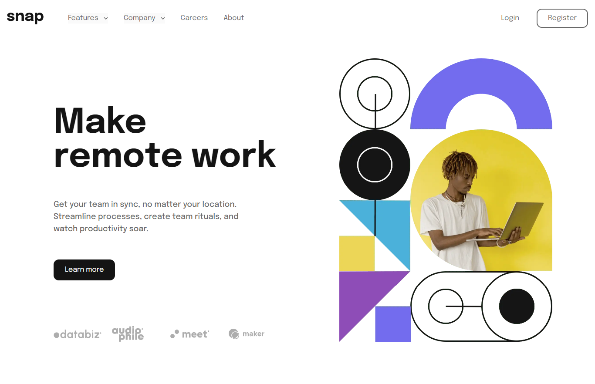

# Frontend Mentor - Intro section with dropdown navigation solution

This is a solution to the [Intro section with dropdown navigation challenge on Frontend Mentor](https://www.frontendmentor.io/challenges/intro-section-with-dropdown-navigation-ryaPetHE5). Frontend Mentor challenges help you improve your coding skills by building realistic projects.

## Table of contents

- [Frontend Mentor - Intro section with dropdown navigation solution](#frontend-mentor---intro-section-with-dropdown-navigation-solution)
  - [Table of contents](#table-of-contents)
  - [Overview](#overview)
    - [The challenge](#the-challenge)
    - [Screenshot](#screenshot)
    - [Links](#links)
  - [My process](#my-process)
    - [Built with](#built-with)
  - [Author](#author)

**Note: Delete this note and update the table of contents based on what sections you keep.**

## Overview

### The challenge

Users should be able to:

- View the relevant dropdown menus on desktop and mobile when interacting with the navigation links
- View the optimal layout for the content depending on their device's screen size
- See hover states for all interactive elements on the page

### Screenshot

### Links

- Solution URL: [Add solution URL here](https://www.frontendmentor.io/solutions/intro-section-with-dropdown-Ul7S5fHVR_)
- Live Site URL: [Add live site URL here](https://intro-section-dengan-dropdown.netlify.app/)

## My process

### Built with

- Semantic HTML5 markup
- Flexbox
- CSS Grid
- Mobile-first workflow
- [React](https://reactjs.org/) - JS library
- [Vite](https://vitejs.dev/) - Frontend tooling
- [Tailwind CSS](https://tailwindcss.com/) - For styles

## Author

- Github - [Wafa Saefulhaq](https://github.com/wafash08)
- Frontend Mentor - [@wafash08](https://www.frontendmentor.io/profile/wafash08)
- Twitter - [@saefulhaqwafa](https://twitter.com/saefulhaqwafa)
